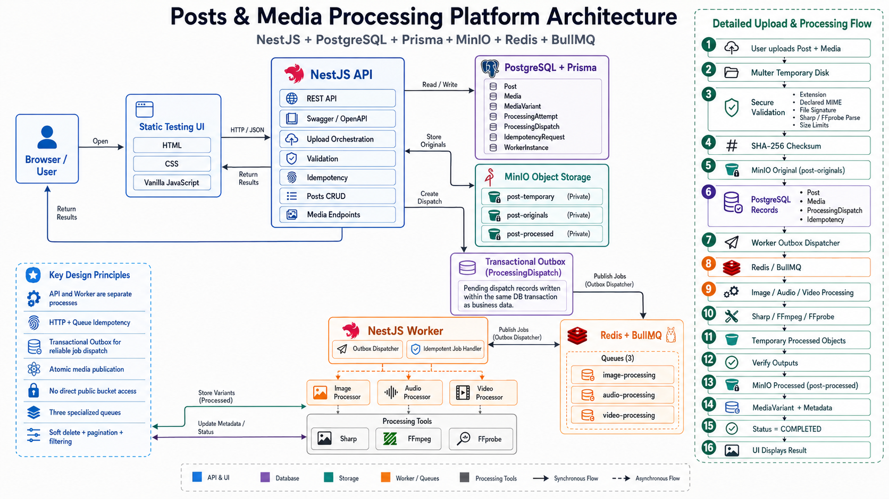

# Posts & Media Processing Platform

A localhost-only NestJS monorepo demonstrating post CRUD and secure asynchronous mixed-media processing. The API stores durable state in PostgreSQL and private objects in MinIO. A separate worker publishes transactional outbox rows to three Redis/BullMQ queues and processes images with Sharp and audio/video with FFmpeg/FFprobe.

This production-style platform also provides HTTP and processing idempotency,
automatic and manual retries, atomic variant publication, diagnostics,
Swagger/OpenAPI, and a static testing dashboard.

## Architecture



The browser/dashboard calls the NestJS API. The API transaction writes Post,
Media, `ProcessingDispatch`, and idempotency state while validated originals
are stored in private MinIO. A separate worker claims outbox rows with leases,
publishes deterministic jobs to BullMQ, and runs independent image, audio, and
video processors. Verified variants are published atomically and recorded in
PostgreSQL. Separate API and worker processes keep CRUD responsive while
media processing is independently scalable and recoverable.

```text
Browser / Dashboard -> NestJS API -> PostgreSQL + Prisma
                              |\-> MinIO originals
                              |\-> ProcessingDispatch outbox
                              v
                    NestJS Worker -> Redis + BullMQ
                                  -> Sharp / FFmpeg / FFprobe
                                  -> MinIO processed + PostgreSQL variants
```

## Run locally

Prerequisites: Docker Compose; or Node.js 24, PostgreSQL 18, Redis 8.6, MinIO, FFmpeg, and FFprobe for running processes directly.

```bash
cp .env.example .env       # optional; Compose defaults work unchanged
docker compose up --build -d
docker compose ps
npm run smoke
```

Open:

- Dashboard: <http://127.0.0.1:3000/>
- Swagger: <http://127.0.0.1:3000/api/docs>
- MinIO console: <http://127.0.0.1:9001/> (default local credentials are in `.env.example`)

`minio-init` creates three private buckets and `migrate` applies `prisma/migrations` before API/worker startup. Host-exposed ports bind to `127.0.0.1`; PostgreSQL and Redis remain internal.

## Key Features and Guarantees

Uploads are disk-staged, checked by extension, declared MIME, signature, size, and decoded/probed limits, then promoted to immutable MinIO originals. The database transaction creates `Media` and `ProcessingDispatch`; API success never depends on Redis. The worker claims outbox rows with leases and publishes deterministic generation-specific BullMQ job IDs. Processing claims, attempts, generation checks, and lease-guarded publication make duplicate delivery safe. A media row becomes `COMPLETED` only in the transaction that records its generated variants.

Queues and default concurrency:

- `image-processing`: 4
- `audio-processing`: 2
- `video-processing`: 1

The `balanced-v1` profile generates WebP image/thumbnail output, 192 kbps MP3 audio, and no-upscale H.264/AAC MP4 ladders (360p/720p/1080p as applicable) plus JPEG thumbnails. Buckets stay private; `/api/media/:id/access` creates fresh 900-second presigned URLs.

The default upload limits are 10 files/request, 500 MB total, 10 MB/image,
50 MB/audio, 250 MB/video, 40 million image pixels, 7,200 seconds/audio,
1,800 seconds/video, and 7,680x4,320 maximum video dimensions. Audio accepts
MP3, WAV, M4A/AAC, FLAC, and OGG inputs; video output is capped at 30 FPS and
uses yuv420p-compatible H.264/AAC MP4. Automatic retries use the configured
BullMQ attempt count; exhausted work is `FAILED` with sanitized diagnostics.
Processed objects are immutable by generation/attempt so a stale worker cannot
remove a newer worker's publication.

Mutating upload/retry routes require `Idempotency-Key`. Reusing a key with the same request replays its stored result; using it with different input is rejected. Manual retry is allowed only from `FAILED` and increments the processing generation. Automatic BullMQ retries retain the generation.

## API

- `POST /api/posts` — JSON or multipart create
- `GET /api/posts` — pagination, search, media/status/date filters, deleted inclusion and sorting
- `GET|PATCH|DELETE /api/posts/:postId`, `POST /api/posts/:postId/restore`
- `POST /api/posts/:postId/media` — partial-success mixed-media addition
- `GET /api/media/:mediaId`, `/status`, `/access`; `POST /retry`
- `GET /api/system/live`, `/ready`, `/diagnostics`

The vanilla HTML/CSS/JavaScript dashboard exposes creation, upload progress, filters, pagination, add media, delete/restore, status polling, retries, diagnostics, JSON/request IDs, and fresh private previews.

## Development and verification

```bash
npm ci
npm run prisma:validate
npm run prisma:generate
npm run lint
npm run format:check
npm run build
docker compose -f docker-compose.test.yml up -d
npm run test:unit
npm run test:integration
npm run test:e2e
npm run test:worker
npm run smoke
```

Generate deterministic valid and corrupt fixtures with `node scripts/create-test-media.mjs tmp/test-media`. Integration tests need the test Compose environment (or equivalent PostgreSQL, Redis, and MinIO endpoints) configured through the variables in `.env.example`. The repository's pinned runtime is Node 24; do not treat host Node 20 results as authoritative.

Troubleshooting: inspect `docker compose logs api worker`, then `/api/system/diagnostics`. `PENDING` dispatches while Redis is down are expected and publish after recovery. Readiness intentionally requires PostgreSQL and MinIO but not Redis. For processing failures, confirm `ffmpeg -version`, `ffprobe -version`, bucket initialization, and writable API/worker temporary roots.

## Processing Flow

1. The API stages each upload on temporary disk and validates extension, declared MIME, signature, size, and decoded/probed limits.
2. Validated originals are checksummed and stored in private `post-originals`.
3. One database transaction records the post/media rows, idempotency result, and `ProcessingDispatch` outbox rows.
4. The worker leases pending dispatches, publishes generation-specific BullMQ jobs, and runs the image/audio/video processor for that media type.
5. Outputs are verified, written to private `post-processed`, and published with metadata atomically; temporary objects are cleaned up.
6. The API exposes status and fresh presigned access URLs while the dashboard polls until `COMPLETED` or shows sanitized failure diagnostics.

## Dashboard

Open <http://127.0.0.1:3000/> after the stack is healthy. The static dashboard supports post creation, mixed-media uploads with progress, filters and pagination, add-media, delete/restore, status polling, retries, diagnostics, request IDs, and private previews.

## Swagger

Open <http://127.0.0.1:3000/api/docs> for the interactive OpenAPI UI or <http://127.0.0.1:3000/api/docs-json> for the generated contract. The documented routes are the authoritative request/response surface.

## Testing

The certification baseline is 279 unit tests, 105 integration tests, 34 HTTP E2E tests, and 22 worker tests (440 total). Run focused suites with `npm run test:unit`, `npm run test:integration`, `npm run test:e2e`, and `npm run test:worker`; integration/E2E/worker suites require the test Compose dependencies.

## Smoke Testing

With API, worker, PostgreSQL, Redis, and MinIO running, execute `npm run smoke`. The smoke flow creates a post, uploads mixed image/audio/video media, polls processing, verifies variants and private access URLs, exercises filtering and idempotent replay, and checks diagnostics.

## Security

All buckets are private; clients receive short-lived presigned GET URLs rather than credentials or public object paths. Uploads are constrained by extension, MIME, signature, size, decoded dimensions/duration, and FFprobe metadata. Errors are sanitized, request IDs are emitted for diagnostics, and retries are generation/lease guarded. Do not commit `.env` files or real credentials.

## Troubleshooting

Use `docker compose ps` and `docker compose logs --tail=200 api worker` first. Check `/api/system/live`, `/api/system/ready`, and `/api/system/diagnostics`. If dispatches remain `PENDING`, verify Redis connectivity and let the worker recover; readiness does not depend on Redis by design. If media fails, verify FFmpeg/FFprobe availability, MinIO bucket initialization, and writable temporary directories.

## Known Limitation

The worker's MinIO heartbeat transport request does not have a hard cancellation primitive if an underlying socket is permanently black-holed. The observer is bounded, single-flight, and shutdown-safe, so this is a contained operational limitation rather than a release blocker; monitor diagnostics and restart the worker if an external transport remains wedged.

## Repository Structure

```text
apps/api         HTTP API, dashboard, Swagger, upload orchestration
apps/worker      outbox dispatcher, queue consumers, processors
libs/            configuration, database, domain, posts, media, storage,
                 queues, media-processing, observability, testing
docs/assets      architecture and documentation assets
docs/superpowers implementation plans and progress evidence
test/e2e         HTTP-level tests
test/integration PostgreSQL/Redis/MinIO/FFmpeg tests
scripts          fixture generation, smoke test, runtime checks
```

## Technology Stack

NestJS, TypeScript, Node.js 24, PostgreSQL, Prisma, Redis, BullMQ, MinIO,
Sharp, FFmpeg, FFprobe, Docker Compose, Jest, Supertest, Swagger/OpenAPI,
and HTML/CSS/vanilla JavaScript.

## Prerequisites

Docker Engine and the Compose plugin are sufficient for the normal workflow.
Node.js 24 and npm are required for repository commands. FFmpeg/FFprobe are
installed in the production images; host binaries are needed only for direct
non-Docker processing.

```bash
node --version
npm --version
docker --version
docker compose version
```

## Services and URLs

| Service       | Address                               |
| ------------- | ------------------------------------- |
| Dashboard     | <http://127.0.0.1:3000/>              |
| API           | <http://127.0.0.1:3000/api>           |
| Swagger       | <http://127.0.0.1:3000/api/docs>      |
| Swagger JSON  | <http://127.0.0.1:3000/api/docs-json> |
| MinIO API     | <http://127.0.0.1:9000>               |
| MinIO Console | <http://127.0.0.1:9001>               |
| PostgreSQL    | internal Compose network, port 5432   |
| Redis         | internal Compose network, port 6379   |

## Environment Configuration

Use `.env.example` as the exact local template. It defines `DATABASE_URL`,
`REDIS_HOST`/`REDIS_PORT`, MinIO endpoint/credentials/buckets, `PORT` and
`API_PREFIX`, upload limits, processing timeouts, queue concurrency, leases,
and `PROCESSING_PROFILE=balanced-v1`. Never commit real credentials.

## Docker Operations

```bash
docker compose up -d
docker compose up --build -d
docker compose ps
docker compose logs -f api worker
docker compose down
```

Destructive reset (deletes local PostgreSQL, Redis, and MinIO volumes):

```bash
docker compose down -v --remove-orphans
```

## Database / Prisma

Migrations in `prisma/migrations` are authoritative; use migrations rather
than `prisma db push` for deployment.

```bash
npm run prisma:validate
npm run prisma:generate
npm run prisma:migrate:dev
npm run prisma:migrate:deploy
```

## Processing Profile and Storage

`balanced-v1` produces auto-oriented/sRGB WebP images and 400px thumbnails,
normalized 192 kbps MP3 audio, and no-upscale H.264/AAC MP4 renditions at
360p/720p/1080p where applicable, plus thumbnails. Input limits are 10 files
and 500 MiB total per request; image/audio/video limits are 10/50/250 MiB.

The private buckets are `post-originals`, `post-processed`, and
`post-temporary`. PostgreSQL stores bucket/object keys; the API creates fresh
900-second presigned GET URLs and never persists those URLs.

## Queue, Outbox, Idempotency, and Retry

Queues are `image-processing` (4), `audio-processing` (2), and
`video-processing` (1). `ProcessingDispatch` is written in the API
transaction, then claimed with leases and `FOR UPDATE SKIP LOCKED` by the
worker dispatcher. `Idempotency-Key` is required for post creation, media
addition, and manual retry; same-request replays are stable and changed input
returns `409`. Automatic retries keep a generation; manual retry increments
the generation, preventing stale workers from overwriting current variants.

## Health and Diagnostics

```text
GET /api/system/live
GET /api/system/ready
GET /api/system/diagnostics
```

Readiness checks PostgreSQL and MinIO. Diagnostics include worker heartbeat,
Redis/storage connectivity, dispatcher/consumer state, active jobs, and
pending/retry/dead dispatch counts. Redis loss leaves API readiness available,
degrades the worker, and preserves recoverable dispatch rows.

## Assignment Requirement Coverage

Each row names the implementation, automated evidence, smoke evidence, and
current status. Commands below were run against the Node 24 test Compose stack;
the clean production-style stack and mixed-media smoke were also rerun.

| Requirement                                      | Implementation                                                         | Automated test evidence                                                        | Smoke evidence                                   | Status   |
| ------------------------------------------------ | ---------------------------------------------------------------------- | ------------------------------------------------------------------------------ | ------------------------------------------------ | -------- |
| Posts CRUD                                       | Posts controller/service/repository, delete/restore                    | `test/e2e/posts.e2e-spec.ts`                                                   | `npm run smoke` CRUD flow                        | COMPLETE |
| MIME validation                                  | `MediaValidationService` MIME policy                                   | `libs/media/src/validation/mime-policy.spec.ts`                                | invalid upload rejected                          | COMPLETE |
| Extension validation                             | Extension policy                                                       | `libs/media/src/validation/extension-policy.spec.ts`                           | spoofed extension rejected                       | COMPLETE |
| File-size validation                             | Per-type and total limits                                              | `media-validation.service.integration.spec.ts`                                 | invalid create rejected                          | COMPLETE |
| File-signature validation                        | Magic-byte detector                                                    | `signature-detector.service.spec.ts`, media validation integration             | corrupt fixture rejected                         | COMPLETE |
| Original media storage                           | Private originals bucket and immutable keys                            | `minio-object-storage.integration.spec.ts`, create-post integration            | mixed upload originals accessed by presigned URL | COMPLETE |
| Processed media storage                          | Private processed/temporary buckets and compensation                   | `variant-publication.service.spec.ts`, worker recovery                         | all mixed-media variants accessible              | COMPLETE |
| Post/Media database records                      | Prisma schema, repositories, outbox/attempt relations                  | `database.integration.spec.ts`                                                 | smoke post/media/status checks                   | COMPLETE |
| Image resize/compression/thumbnail               | Sharp image processor                                                  | `image-processor.service.spec.ts`, create-post integration                     | mixed image reaches COMPLETED with variants      | COMPLETE |
| Audio duration/metadata/MP3                      | FFprobe + normalized 192 kbps MP3                                      | `audio-processor.integration.spec.ts` (MP3/WAV/M4A/FLAC/OGG, channels)         | WAV mixed-media upload completes                 | COMPLETE |
| Video compression/metadata/thumbnail/resolutions | FFprobe + H.264/AAC no-upscale ladder                                  | `video-processor.integration.spec.ts` (1080/720/480/sub-360/portrait/no-audio) | MP4 mixed-media upload completes                 | COMPLETE |
| Redis + BullMQ processing                        | Transactional outbox and three queues                                  | `queue-publication.integration.spec.ts`, worker recovery                       | clean Compose worker/Redis healthy               | COMPLETE |
| Processing states                                | PENDING/PROCESSING/COMPLETED/FAILED transitions                        | `worker-recovery.integration.spec.ts`                                          | smoke polls to COMPLETED                         | COMPLETE |
| Failed-job retry                                 | Automatic attempts plus manual generation retry                        | `worker-recovery.integration.spec.ts`, `media-retry.e2e-spec.ts`               | retry path exercised in real queue               | COMPLETE |
| Media status endpoint                            | `GET /api/media/:mediaId/status`                                       | `media-retry.e2e-spec.ts`                                                      | smoke polling                                    | COMPLETE |
| Idempotent processing                            | Deterministic job IDs, leases, generation/attempt keys                 | queue publication, worker recovery, retry E2E                                  | replayed create request remains one resource     | COMPLETE |
| Pagination/filtering                             | Typed `GET /api/posts` query contract                                  | `posts.e2e-spec.ts`                                                            | smoke filtered list                              | COMPLETE |
| Soft delete                                      | Delete, include-deleted reads, restore                                 | `posts.e2e-spec.ts`                                                            | smoke delete/restore                             | COMPLETE |
| Swagger documentation                            | `/api/docs` and `/api/docs-json`                                       | `apps/api/src/main.spec.ts`                                                    | clean-stack docs JSON exposes 11 paths           | COMPLETE |
| Unit/integration/E2E tests                       | Jest unit, PostgreSQL/Redis/MinIO integration, HTTP E2E, worker suites | 279 unit, 105 integration, 34 E2E, 22 worker (440 total)                       | `npm run smoke`                                  | COMPLETE |
